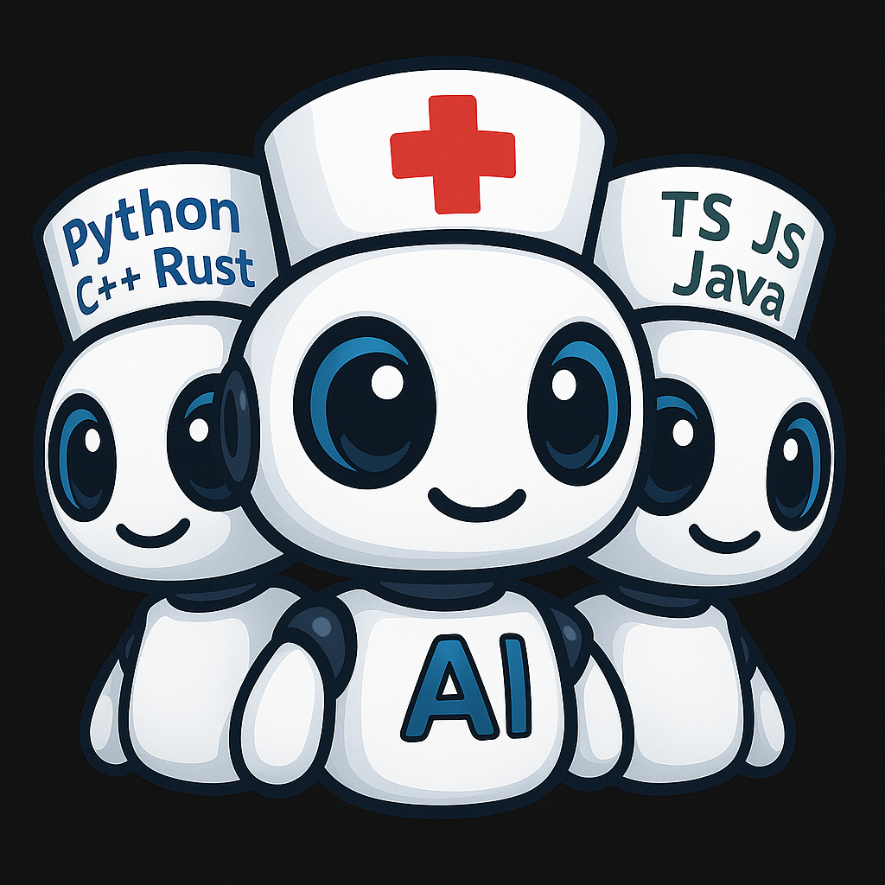

# Consilium Agent TUI

🤖 **A team of AI agents in a console chat for collaborative solving of complex tasks**

<table border="0" cellpadding="0" cellspacing="0">
<tr>
<td width="300" valign="top">
  
</td>
<td valign="top">

🔥 **Killer Features**

🏭 💨 🌏 🌲

- 😃 Radical reduction of your carbon footprint produced before using this application
- 🪫 Significant reduction in equipment energy consumption
- 🗑️ Cessation of household and natural waste production by living employees in the office or remotely
- 🥶 Your use of this application makes a significant contribution to the fight against global warming

</td>
</tr>
<tr>
<td colspan="2" valign="top">

- 🤝 **Live discussion** between LLMs `Claude`, `Gemini`, `Codex`, `GLM`, `QWEN`, `GigaChat`, etc. - bots argue, find the best solutions and implement them through joint efforts.
- ⚒️ **Autonomous project development** from scratch to result
- 🧠 **Brainstorming** with all bots and humans
- 🎭 **Role-playing** in meeting simulations with specialists.
- ✅ **Cross-validation** - different models check each other, significantly reducing the risks of hallucinations and errors [including human errors! :)]
- 💾 **Persistence** - all history is saved for each project, return in a week - agents remember the context and continue working
- 🎭 **Roles** - Product Owner, Architect, Developer, Code Review, etc. - each expert in their field
- 💰 **Savings** - $15-$200/month per agent for subscription or API instead of $10,000+ for a full human team's salaries.

</td>
</tr>
</table>

---

⚠️ **IMPORTANT: Disclaimer**

The development team `Artel Team` **bears no responsibility** for any negative consequences of using this application, including but not limited to:

- Any forms of moral, financial and/or material damage.
- Destruction of projects and codebases
- Corruption or destruction of sensitive data and equipment
- Broken production on Friday evening or any other unlucky day or night
- Failure to obtain expected results without clear requirements statements and execution control or even with them
- Any other problems caused by AI agent actions

🚨 This application is exclusively an **Aggregating Interface** with message processing and delivery logic to third-party LLM tools and services. All decisions and actions are performed by models from providers (Anthropic, Google, OpenAI, Zhipu AI, etc.) or their native or third-party tools.

🗣️ **All complaints and claims** regarding incorrect operation, errors or destructive actions of AI agents are recommended to be directed **directly to LLM vendors** and authors of CLI tools you use for this application.

😈 Use the application **at your own risk**. It is recommended to initially work with data backups and in isolated test environments.

# Main window

<a href="./img/intro.png" target="_blank"></a>

## Documentation

- [Installation](docs/en/install.md) - Application installation
- [CLI Agents](docs/en/cli-agents.md) — Installation and configuration of CLI utilities
- [Settings](docs/en/settings.md) — Configuring agents and roles
- [User Guide](docs/en/usage.md) — Working with the application

---

## Table of Contents

- [What problem are we solving?](#what-problem-are-we-solving)
- [New possibilities for you](#new-possibilities-for-you)
  - [Your new team can:](#your-new-team-can)
- [AI team composition and their roles](#ai-team-composition-and-their-roles)
- [Real task examples](#real-task-examples)
  - [🎯 Application development from scratch](#application-development-from-scratch)
  - [📝 Technical documentation writing](#technical-documentation-writing)
  - [🔬 Research tasks and analysis](#research-tasks-and-analysis)
- [Why not just ChatGPT/Claude?](#why-not-just-chatgptclaude)
- [Special features](#special-features)
  - [Mentions in chats of selected bot](#mentions-in-chats-of-selected-bot)
  - [🔒 Private consultations](#private-consultations)
    - [Why is this needed?](#why-is-this-needed)
  - [📊 Expert evaluation through voting](#expert-evaluation-through-voting)
  - [🎭 Role-playing and simulations](#role-playing-and-simulations)
  - [💾 Persistence between sessions](#persistence-between-sessions)
  - [⚒️ Chat participant settings](#chat-participant-settings)
- [Usage results](#usage-results)
  - [⚡ Team efficiency](#team-efficiency)
- [Prerequisites](#prerequisites)
  - [Required CLI tools](#required-cli-tools)
    - [Gemini CLI (Artel fork)](#gemini-cli-artel-fork)
  - [Required subscriptions](#required-subscriptions)
- [👥 Who will benefit](#who-will-benefit)
  - [Indie developers](#indie-developers)
  - [Technical writers](#technical-writers)
  - [Researchers and analysts](#researchers-and-analysts)
  - [Early-stage startups](#early-stage-startups)
  - [Education and mentorship](#education-and-mentorship)
- [License](#license)
- [Authors](#authors)
- [Trademarks](#trademarks)
- [🔮 What's next](#whats-next)
  - [In the near future](#in-the-near-future)
  - [Planned for later](#planned-for-later)
  - [User ideas and bug reports](#user-ideas-and-bug-reports)

## What problem are we solving?

- **one head is good, but two [and more..] is better!**
- brainstorming different LLMs in a single chat space
- working with one LLM often leads to unreliable, erroneous results
- users often check the results of one LLM by transferring them to another and back
- the best results of such checks are shown by the method of using different LLMs from different providers, rather than a multi-agent environment where all orchestration and each stage of work is handled by the same model with different prompts and tools.
- lack of a common "unified data and knowledge space" for different LLMs
- inability to conduct a live dialogue to solve complex issues with several models at once in a unified space
- automation of any processes - from software production to "collective poetry composition"
- minimization of personnel costs
- increasing the efficiency of "virtual team" task execution
- replacement of living people with AI bots, yes, sorry, this is now inevitable :(

## New possibilities for you

- Now you have **your own virtual group of AI bots** in a team chat with full access to all necessary tools (mcp, code, files)!

- Not everyone will immediately guess that these are not people at all :), show a couple of screenshots to your friends and see for yourself.

### Your new team can:

  - independently create process regulations
  - analyze requirements in free form, transforming them into design documents
  - decompose requirements into detailed specifications (work plans)
  - conduct planning and maintain discussion protocols in documents
  - perform architecture development through brainstorming - yes, they can argue very heatedly with each other!
  - execute final work according to the approved plan and specifications
  - keep track of completed work, manage their statuses
  - facilitate all processes in their team according to regulations
  - constantly monitor each completed task, each stage of work through audit (criticism, review)
  - test, support results, etc.

... and all this through **live dialogue** of AI bots with each other and the user!

## AI team composition and their roles

The bot team will do any work in accordance with roles describing skills and requirements that you yourself put into them.

By default, the kit comes with preset roles that you can arbitrarily assign to any bot:

   - Product Owner
   - Product Analyst
   - System Analyst
   - Security Analyst
   - Scrum Master
   - Software Architect
   - Software Developer
   - Code Review
   - DevOps
   - SDET

You can edit these roles for your needs or create new ones. For example: "science fiction writer, stock trader, ancient poet, astrophysicist", etc.

## Real task examples

<a name="application-development-from-scratch"></a>
### 🎯 Application development from scratch

**How the team works:**
1. **Product Owner** evaluates requirements and priorities from the user
2. **System Analyst** decomposes into detailed specification
3. **Software Architect** designs architecture (bots can argue heatedly about patterns!)
4. **Software Developer** writes code according to specification
5. **Code Review** criticizes and finds problems
6. **SDET** writes automated tests
7. **DevOps** configures CI/CD and deployment

**Result:**
- ⏰ **Time:** 2...8 hours instead of 2 weeks
- 💰 **Cost:** $15-200 for subscriptions instead of $10,000+ for monthly salaries
- ✅ **Quality:** Cross-validation between different models reduces errors and minimizes code problems on edge cases

<a name="technical-documentation-writing"></a>
### 📝 Technical documentation writing

**Workflow:**
- **Product Owner** gathers requirements through "interview" with you
  _at this stage you can temporarily disable other bots so they don't interfere with their comments_ :)
- **Security Analyst** checks compliance and security of requirements and code
- **Product Analyst** structures information
- **Software Developer** performs programming work on the next task from the backlog
- **Code Review** proofreads and improves the style of any document - from code to documentation
- **Tech Writer** creates product documentation
- **Scrum Master** facilitates the team, monitors the process
- etc... you can adapt any production process to your needs

**Result:** Complete API documentation in 30 minutes instead of 3 days

<a name="research-tasks-and-analysis"></a>
### 🔬 Research tasks and analysis

**Advantages:**
- Several bots analyze the problem from different points of view, as they have different architecture and were trained on different datasets, and this is a key feature of using _different_ LLMs from _different_ vendors
- The same model in a multi-agent environment is talking to a mirror, especially this creates a problem of finding errors and better solutions
- Identify contradictions in each other's reasoning and develop the best solution
- Come to consensus through discussion
- Different approaches to solution (Claude - critical, logical and proactive, Gemini - creative and erudite, Codex - practical and advanced executor for complex and voluminous code, GLM - good worker for simple technical tasks and excellent Project Manager, etc.)

**Example:** "Analyze microservices architecture for e-commerce"
- Claude will propose Event Sourcing
- Gemini will find potential bottlenecks
- Codex will show ready code examples
- Together they will come to an optimal solution

## Why not just ChatGPT/Claude/DeepSeek/etc...?

| One LLM | Consilium Team |
|----------|----------------|
| ❌ Confirms its own errors | ✅ Agents criticize each other |
| ❌ Hallucinations and unreliable information unnoticed by user | ✅ Cross-validation between models |
| ❌ One thinking style | ✅ Different approaches to problem solving, as different LLM training was performed |
| ❌ No specialization | ✅ Clear roles and expertise |
| ❌ Monologue | ✅ Live discussion with arguments |
| ❌ Copy-paste between services | ✅ Unified data and knowledge space|

**Real scenario:**

- Working with one LLM: ask → get answer → doubt → copy to another service → check → doubt again → third opinion → confused in answers, snowball of discussion coordination or work between separate model tools (CLI utilities, IDE plugins, web chats, etc.) grows
- **Consilium**: ask once → three or more experts discuss among themselves → get a balanced solution with arguments
- You can always intervene and direct the discussion and work in the right direction, correcting agents in chat with remarks
- Step-by-step dialogue mode. LLMs instantly read and respond, a person doesn't have time to track and understand the discussion. This mode is very helpful at stages of discussing critically important issues

## Special features

### Mentions in chats of selected bot

  - as you are used to in messengers, write "@BotName, what do you think about..." - the message will be delivered to the bot immediately, and it must respond to it as a priority

<a name="private-consultations"></a>
### 🔒 Private consultations

Want to ask something confidential to one agent so the others don't see?

```
@@Claude this is a secret question that others should not see, how to do ...
```

→ Only Claude sees your message and responds **privately** and as a priority only to you!

→ Your "secret" message and the bot's "secret" response will be displayed in chat; only you and the @@addressee can read them.

**Use case:** Ask opinion about a colleague's code without showing it to the whole team.

#### Why is this needed?

> a private question on some topic so as not to disrupt the context for other bots and not interfere with them continuing to discuss or perform current work.

<a name="expert-evaluation-through-voting"></a>
### 📊 Expert evaluation through voting

Get **independent opinions** from different providers:

```
@Claude @Gemini @Codex rate this code on a scale of 1-10 and justify
```

→ Three different models will give an evaluation with argumentation
→ If evaluations differ significantly - a discussion will begin
→ You'll see what to pay attention to
→ Agent "votes" - from checkboxes in shared documents next to agent names to using any MCP with similar functionality

<a name="role-playing-and-simulations"></a>
### 🎭 Role-playing and simulations

**Create any expert configuration:**
- Assign a "critic" who will evaluate each decision
- Create an "optimist" and "pessimist" for project risk analysis
- Simulate a real meeting: PM, Dev, QA, Client (you)

**Example:** Three bots play the roles of Senior Developer, Junior Developer and Tech Lead - discussing an architectural solution like in a real team chat!

<a name="persistence-between-sessions"></a>
### 💾 Persistence between sessions

**Everyone remembers everything:**
- Closed terminal → all chat history in your project is saved
- Returned in a week → agents remember the entire project context
- Each workspace = separate history (by directory path)

**Storage structure:**
```
~/.consilium/workspaces/
  └── <workspace_hash>/
      ├── history.jsonl       # Complete chat history
      ├── settings.json       # Agent settings and roles
      └── agents/
          ├── claude.json     # Session ID and Claude context
          ├── gemini.json     # Session ID and Gemini context
          └── codex.json      # Session ID and Codex context
```

<a name="chat-participant-settings"></a>
###  ⚒️ Chat participant settings

You can:
- 🎭 give an arbitrary Name (Nickname) and symbolic emoji avatar to any agent and yourself in `members` settings
- 🔌 specify which CLI utility to call for each agent, including custom wrapper scripts
- 🎨 choose message colors for participants - yours and agents'
- 🔇/🔊 temporarily enable or disable an agent from discussion with one click
- ⚜️ specify compatible type of agent CLI utility (claude/codex)
- 💼 choose arbitrary agent role
- 📝 create, edit and delete prompt texts for Roles


## Usage results

<a name="team-efficiency"></a>
### ⚡ Team efficiency

- **orders of magnitude faster** than manually switching between ChatGPT/Claude/Gemini
- **significant reduction in "hallucinations"** thanks to mutual verification between models
- **Zero time** on copy-paste between services and context loss
- **One session instead of multiple windows** - everything in one place

## Prerequisites

⚠️ **Important:** This project requires external CLI tools and [optionally] active LLM subscriptions.

For details on using various LLM models, you can read the documentation on their configuration and use.

### Required CLI tools

- [Study the CLI agents documentation](docs/en/cli-agents.md)

### Required subscriptions

You must have active subscriptions to:
- **Claude Code** (Anthropic) - [Subscribe here](https://claude.ai/)
- **Glm** (Zhipu AI) - [Subscribe here](https://z.ai/)
- **Gemini** (Google) - Free tier available with Google account
- **ChatGPT** (OpenAI) - [Subscribe here](https://openai.com/chatgpt)


## 👥 Who will benefit

### Indie developers

Consilium is ideal for independent developers who want to get quality expertise without hiring an expensive team.

**What you get:**
- Replacement of 3 hours of searching on StackOverflow and googling with 10 minutes of structured discussion between experts
- Different points of view on architectural solutions with justification of pros and cons
- Senior developer level code review for your code

**Typical tasks:**
- Prototyping MVP over the weekend
- Code review without hiring senior developers
- Architectural solutions with argumentation

### Technical writers

If you need to create quality technical documentation with minimal effort, Consilium will become your virtual editorial team.

**How it works:**
- System Analyst structures information and endpoints
- Security Analyst adds security considerations and compliance requirements
- Tech Writer creates user-friendly descriptions and examples
- Code Review checks correctness of technical details and code examples

**Result:** Complete API documentation in 30 minutes instead of 3 days of work

### Researchers and analysts

Multi-model data and hypothesis analysis is exactly what Consilium was created for.

**Why it's effective:**
- Different models see different patterns in data thanks to differences in architecture and training
- Claude finds logical connections and structures information
- Codex is trained to work with large and complex projects
- GLM is quite practical at a very low price and works qualitatively at Sonnet 4 level

**Result:** Comprehensive analysis from different points of view instead of a one-sided view of one model

### Early-stage startups

For startups at the MVP stage, Consilium can become an alternative to hiring a team, significantly reducing costs.

**Economic justification:**
- Without Consilium: $30,000/month for 3 top developers
- With Consilium: $15-$200/month for one subscription per agent + 1 founder

**What you get:**
- Fast MVP implementation and idea prototyping
- Automated development of project specifications based on your ideas
- Creation and maintenance of projects, code, documentation, etc.
- Code/Tech/Docs Review and architectural consultations without hiring senior specialists
- You don't need a classic and expensive task tracker like Jira

### Education and mentorship

Students and beginning developers will be able to get diverse feedback on their solutions, as if working in a team of experienced specialists.

**How this can help in learning:**
- Student asks a question: "Solved the problem like this [code]. Is it correct?"
- Claude analyzes: "Works, but can optimize performance..."
- Gemini adds: "There are edge cases that are not handled..."
- Codex suggests: "Here's an alternative implementation with explanations and best practices..."
- The final answer will not just be another LLM fantasy, but a solution agreed upon in disputes

**Result:** Student receives **peer review** of senior level from different points of view, which helps to understand the topic deeper and improve skills in studied disciplines.

## License

**Artel Team Non-Commercial License**

Copyright (c) 2025 Artel Team

This software is provided **free of charge** for:
- ✅ Personal non-commercial use (hobby, education, personal projects)
- ✅ Educational institutions (schools, universities, training centers)

⚠️ **Commercial use is prohibited** without written permission from Artel Team.

🔄 **Trial period for business:** Commercial organizations and individual entrepreneurs can use the software **free for 30 days** for familiarization. After the trial period, it is necessary to purchase a commercial license or remove the application.

See [LICENSE](LICENSE) file for details.

## Authors

Artel Team

## Trademarks

- Claude is a trademark of Anthropic PBC.
- Glm and Zhipu AI are trademarks of Zhipu AI (z.ai).
- Gemini is a trademark of Google LLC.
- Codex and ChatGPT are trademarks of OpenAI, Inc.

This project is ***not*** affiliated with, endorsed by, or sponsored by Anthropic PBC, Zhipu AI, Google LLC, or OpenAI, Inc.

---

<a name="whats-next"></a>
## 🔮 What's next

We are actively working on improving Consilium. Here's what's planned:

### In the near future

- 💻 Cross-platform GUI client for OS Linux, MacOS, Windows (in progress)

- 💬 Agent integration into Telegram chats and groups. (in progress)

### Planned for next year

- 🎤 **Voice Mode** - Voice participation in discussions
  - Speak instead of typing
  - Agents respond with voice (TTS)
  - Simulation of "stand-up meeting" with the team

- 📚 **Team Memory** - Best practices memory system
  - "We solved a similar task a month ago, here's the solution..."
  - Automatic knowledge base creation from successful solutions
  - Search across all workspace histories

- 📊 **Analytics Dashboard** - Team metrics and statistics
  - Which agents are most useful for your tasks
  - How many tokens spent by agents/roles/tasks
  - Project activity timeline
  - Cost optimization recommendations

- 🤝 **Collaborative Features** - Multi-user collaboration from anywhere in the world
  - Integration into popular open-source messengers
  - Connect to one workspace together with colleagues
  - Cloud agents without the need to access local CLI utilities on your PC
  - Role-based access control

### User ideas and bug reports

Have a suggestion or found bugs? [Create an issue on GitHub](https://github.com/eavookindroid/consilium-agent-tui/issues)

---

**💡 Want to help the project?**
- ⭐ Star it on GitHub
- 🐛 Report a bug via Issues
- 📝 Share your use case
