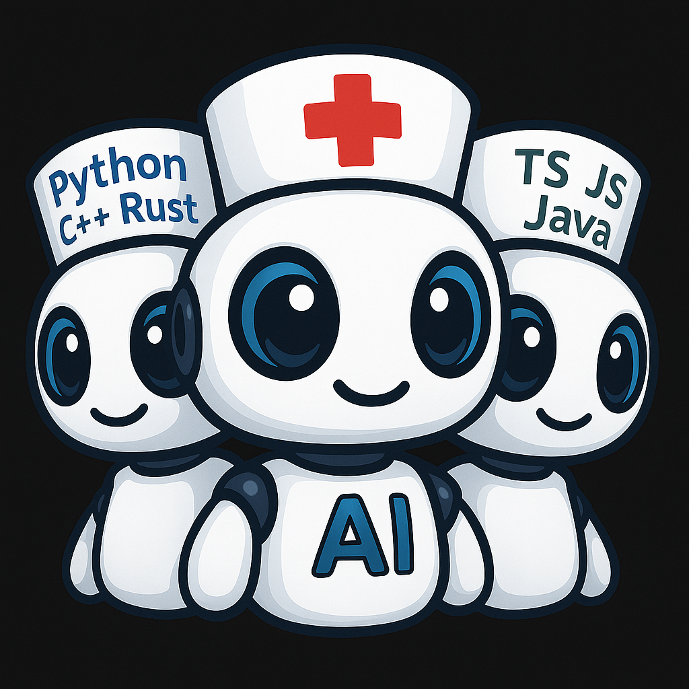

# Consilium Agent TUI

 🤖 **Команда AI-агентов в консольном чате для коллективного решения сложных задач**

<table border="0" cellpadding="0" cellspacing="0">
<tr>
<td width="300" valign="top">
  
</td>
<td valign="top">

🔥 **Киллер-фичи**

🏭 💨 🌏 🌲

- 😃 Радикальное снижение углеродного следа производимого Вами до использования этого приложения
- 🪫 Значительное снижение энергозатрат на оборудование
- 🗑️ Прекращение производства бытовых и естественных отходов живых сотрудников в офисе или на удаленке  
- 🥶 Использование вами этого приложения привносит значительный вклад в борьбу с глобальным потеплением  

</td>
</tr>
<tr>
<td colspan="2" valign="top">

- 🤝 **Живая дискуссия** между LLM `Claude`, `Gemini`, `Codex`, `GLM`, `QWEN`, `GigaChat` и т.д. - боты спорят, находят лучшие решения и воплощают их совместными усилиями.
- ⚒️ **Автономная разработка проектов** с нуля и до результата
- 🧠 **Мозговой штурм** всех ботов с человеком
- 🎭 **Ролевые игры** в симуляциях митингов со специалистами.
- ✅ **Кросс-валидация** - разные модели проверяют друг друга, значительно снижая риски галлюцинаций и ошибок друг друга [и людей! :)]
- 💾 **Персистентность** - вся история сохраняется для каждого проекта, вернётесь через неделю - агенты помнят контекст и продолжат работу
- 🎭 **Роли** - Product Owner, Architect, Developer, Code Review и т.д. - каждый эксперт в своём деле
- 💰 **Экономия** - $15-$200/мес за агента на подписку или API вместо $10,000+ на зарплаты полной команды людей.

</td>
</tr>
</table>

---

⚠️ **ВАЖНО: Отказ от ответственности**

Команда разработчиков `Artel Team` **не несёт никакой ответственности** за любые негативные последствия использования данного приложения, включая, но не ограничиваясь:

- Любые формы морального, финансового и/или материального ущерба.
- Разгром проектов и кодовых баз
- Порчу или уничтожение чувствительных данных и оборудования
- Сломанный прод в пятницу вечером или любой иной несчастливый день или ночь
- Неполучение ожидаемых результатов без внятных постановок требований и контроля выполнения или даже с оными
- Любые другие проблемы, вызванные действиями AI-агентов

🚨 Данное приложение является исключительно **Агрегирующим Интерфейсом** с логикой обработки и доставки сообщений к сторонним LLM инструментам и сервисам. Все решения и действия выполняются моделями провайдеров (Anthropic, Google, OpenAI, Zhipu AI и др.) или их нативными или сторонними инструментами.

🗣️ **Все жалобы и претензии** относительно некорректной работы, ошибок или разрушительных действий AI-агентов рекомендуется направлять **непосредственно вендорам LLM** и авторам cli-инструментов, применяемых вами для работы этого приложения.

😈 Используйте приложение **на свой страх и риск**. Рекомендуется для начала работать с резервными копиями данных и в изолированных тестовых окружениях.

## Документация

- [Установка](docs/ru/install.md) - Установка приложения
- [CLI-агенты](docs/ru/cli-agents.md) — Установка и настройка CLI-утилит
- [Настройки](docs/ru/settings.md) — Настройка агентов и ролей
- [Руководство пользователя](docs/ru/usage.md) — Работа с приложением

---

## Оглавление

- [Какую проблему мы решаем?](#какую-проблему-мы-решаем)
- [Новые возможности для вас](#новые-возможности-для-вас)
  - [Ваша новая команда умеет:](#ваша-новая-команда-умеет)
- [Состав ai-команды и их роли](#состав-ai-команды-и-их-роли)
- [Примеры реальных задач](#примеры-реальных-задач)
  - [🎯 Разработка приложения с нуля](#разработка-приложения-с-нуля)
  - [📝 Написание технической документации](#написание-технической-документации)
  - [🔬 Исследовательские задачи и анализ](#исследовательские-задачи-и-анализ)
- [Почему не просто ChatGPT/Claude?](#почему-не-просто-chatgptclaude)
- [Специальные возможности](#специальные-возможности)
  - [Упоминания в чатах выбранного бота](#упоминания-в-чатах-выбранного-бота)
  - [🔒 Приватные консультации](#приватные-консультации)
    - [Зачем это нужно?](#зачем-это-нужно)
  - [📊 Экспертная оценка через голосование](#экспертная-оценка-через-голосование)
  - [🎭 Ролевые игры и симуляции](#ролевые-игры-и-симуляции)
  - [💾 Персистентность между сессиями](#персистентность-между-сессиями)
  - [⚒️ Настройки участников чата](#настройки-участников-чата)
- [Результаты использования](#результаты-использования)
  - [⚡ Эффективность команды](#эффективность-команды)
- [Предварительные требования](#предварительные-требования)
  - [Необходимые CLI инструменты](#необходимые-cli-инструменты)
    - [Gemini CLI (форк Artel)](#gemini-cli-форк-artel)
  - [Необходимые подписки](#необходимые-подписки)
- [👥 Кому будет полезно](#кому-будет-полезно)
  - [Indie разработчики](#indie-разработчики)
  - [Технические писатели](#технические-писатели)
  - [Исследователи и аналитики](#исследователи-и-аналитики)
  - [Стартапы на ранних стадиях](#стартапы-на-ранних-стадиях)
  - [Образование и менторство](#образование-и-менторство)
- [Лицензия](#лицензия)
- [Авторы](#авторы)
- [Товарные знаки](#товарные-знаки)
- [🔮 Что дальше](#что-дальше)
  - [В ближайшем будущем](#в-ближайшем-будущем)
  - [Запланировано на потом](#запланировано-на-потом)
  - [Идеи и багрепорты от пользователей](#идеи-и-багрепорты-от-пользователей)

## Какую проблему мы решаем?

- **одна голова хорошо, а две [и больше..] - лучше!**
- мозговой штурм разных LLM в едином пространстве чата
- работа с одной LLM часто приводит к недостоверным, ошибочным результатам
- пользователи часто проверяют результаты работы одной LLM, передавая их в другую и обратно
- наилучшие результаты таких проверок показывает метод использования разных LLM от разных провайдеров, а не мультиагентная среда, где всей оркестрацией и каждым этапом неких работ занимается одна и та же модель с разными промптами и инструментами.
- отсутствие общего "единого пространства данных и знаний" для разных LLM
- невозможность ведения живого диалога для решения сложных вопросов с несколькими моделями сразу в едином пространве
- автоматизация любых процессов - от производства программного обеспечения, до "коллективного сочинения стихов"
- минимизация затрат на персонал
- повышение эффективности выполнения задач "виртуальной командой"
- замена живых людей ai-ботами, да, простите, это теперь неизбежно :(

## Новые возможности для вас

- Теперь у вас есть **собственная виртуальная группа ai-ботов** в командном чате с полным доступом ко всем нужным инструментам (mcp, код, файлы)!

- Далеко не все сразу догадаются, что это вообще не люди :), покажите пару скриншотов своим друзьям и убедитесь сами.

### Ваша новая команда умеет:

  - составлять самостоятельно регламенты процессов
  - анализировать требования в свободной форме, преобразуя их в дизайн-документы
  - декомпозировать требования в детализированные спецификации (планы работ)
  - проводить планирование и вести протокол обсуждений в документах
  - выполнять разработку архитектуры через мозговой штурм - да, они могут очень жарко спорить друг с другом!
  - исполнять конечные работы по утвержденному плану и спецификациям
  - вести учёт выполненных работ, управлять их статусами
  - фасилитировать все процессы в своей команде согласно регламентам
  - постоянно контролировать каждую выполненную задачу, каждый этап работ через аудит (критику, ревью)
  - тестировать, сопровождать результаты и т.д.

... и всё это через **живой диалог** ai-ботов друг с другом и пользователем!

## Состав ai-команды и их роли

Команда ботов будет делать любые работы в соответствии с ролями, описывающими навыки и требования, которые вы сами в них заложите. 

По умолчанию в комплекте поставляются предустановленные роли, которые вы можете произвольно назначать любому боту:

   - Product Owner
   - Product Analyst
   - System Analyst
   - Security Analyst
   - Scrum Master
   - Software Architect
   - Software Developer
   - Code Review
   - DevOps
   - SDET

Вы можете отредактировать эти роли под свои нужды или создать новые. Например: "писатель-фантаст, трейдер на бирже, античный поэт, астрофизик" и т.д.

## Примеры реальных задач

<a name="разработка-приложения-с-нуля"></a>
### 🎯 Разработка приложения с нуля

**Как работает команда:**
1. **Product Owner** оценивает требования и приоритеты от пользователя
2. **System Analyst** декомпозирует в детальную спецификацию
3. **Software Architect** проектирует архитектуру (боты могут жарко спорить о паттернах!)
4. **Software Developer** пишет код по спецификации
5. **Code Review** критикует и находит проблемы
6. **SDET** пишет автоматические тесты
7. **DevOps** настраивает CI/CD и деплой

**Результат:**
- ⏰ **Время:** 2...8 часов вместо 2 недель
- 💰 **Стоимость:** $15-200 за подписки вместо $10,000+ на зарплаты в месяц
- ✅ **Качество:** Cross-validation между разными моделями снижает ошибки и минимизирует проблемы кода на edge-cases

<a name="написание-технической-документации"></a>
### 📝 Написание технической документации

**Workflow:**
- **Product Owner** собирает требования через "интервью" с вами
  _на этом этапе можно временно выключить других ботов, чтобы не мешали своими комментариями_ :)
- **Security Analyst** проверяет compliance и безопасность требований и кода
- **Product Analyst** структурирует информацию
- **Software Developer** выполняет работу по программированию очередной задачи из бэклога
- **Code Review** вычитывает и улучшает стиль любого документа - от кода до документации
- **Tech Writer** составляет документацию на продукт
- **Scrum Master** выполняет фасилитацию команды, следит за процессом  
- и т.д... любой производственный процесс вы можете адаптировать под свои нужды

**Результат:** Полная документация API за 30 минут вместо 3 дней

<a name="исследовательские-задачи-и-анализ"></a>
### 🔬 Исследовательские задачи и анализ

**Преимущества:**
- Несколько ботов анализируют проблему с разных точек зрения, т. к. они имеют разную архитектуру и обучались на разных датасетах, и это ключевая фича использования именно _разных_ LLM от _разных_ вендоров
- Одна и та же модель в мультиагентной среде — разговор с зеркалом, особенно это создаёт проблему поиска ошибок и лучших решений
- Выявляют противоречия в рассуждениях друг друга и вырабатывают лучшее решение
- Приходят к консенсусу через дискуссию
- Разные подходы к решению (Claude - критичный, логичный и проактивный, Gemini - креативный и эрудит, Codex - практичный и продвинутый исполнитель для сложного и объёмного кода, GLM - неплохой трудяга для несложных технических заданий и отличный Руководитель Проекта и т.д.)

**Пример:** "Проанализируйте архитектуру микросервисов для e-commerce"
- Claude предложит Event Sourcing
- Gemini найдёт potential bottlenecks
- Codex покажет готовые примеры кода
- Вместе придут к оптимальному решению

## Почему не просто ChatGPT/Claude/DeepSeek/etc...?

| Одна LLM | Consilium Team |
|----------|----------------|
| ❌ Подтверждает свои же ошибки | ✅ Агенты критикуют друг друга |
| ❌ Галлюцинации и недостоверные сведения незаметны пользователю | ✅ Cross-validation между моделями |
| ❌ Один стиль мышления | ✅ Разные подходы к решению задач, т. к. выполнялось разное обучение LLM |
| ❌ Нет специализации | ✅ Чёткие роли и экспертиза |
| ❌ Монолог | ✅ Живая дискуссия с аргументами |
| ❌ Copy-paste между сервисами | ✅ Единое пространство данных и знаний|

**Реальный сценарий:**

- Работа с одной LLM: спрашиваешь → получаешь ответ → сомневаешься → копируешь в другой сервис → проверяешь → опять сомневаешься → третье мнение → запутался в ответах, нарастает снежный ком согласований дискуссии или работы между отдельными инструментами моделей (cli-утилиты, плагины к IDE, веб-чаты и т.д.)
- **Consilium**: спрашиваешь один раз → три и более экспертов обсуждают между собой → получаешь взвешенное решение с аргументами
- Всегда можешь вмешаться и направить обсуждение и работы в нужное русло, корректируя агентов в чате репликами
- Пошаговый режим диалога. LLM мгновенно читают и отвечают, человек не успевает отследить и понять дискуссию. Такой режим очень помогает на этапах обсуждения критически важных вопросов

## Специальные возможности

### Упоминания в чатах выбранного бота

  - как обычно вы привыкли в мессенджерах, напишите "@BotName, а что ты думаешь о..." - сообщение будет доставлено боту немедленно, и он будет обязан отреагировать на него приоритетно

<a name="приватные-консультации"></a>
### 🔒 Приватные консультации

Хотите спросить что-то конфиденциальное у одного агента, чтобы остальные не видели?

```
@@Claude это секретный вопрос, который не должны видеть остальные, как сделать ...
```

→ Только Claude видит ваше сообщение и отвечает **приватно** и приоритетно только вам!

→ Ваше "секретное" сообщение и "секретный" ответ бота отобразятся в чате; читать их могут только вы и @@адресат.

**Use case:** Спросите мнение о коде коллеги, не показывая его всей команде.

#### Зачем это нужно?

> частный вопрос по какой-то теме, чтобы не сбивать контекст для других ботов и не мешать им продолжать выполнять обсуждение или выполнение текущих работ.

<a name="экспертная-оценка-через-голосование"></a>
### 📊 Экспертная оценка через голосование

Получите **независимые мнения** от разных провайдеров:

```
@Claude @Gemini @Codex оцените этот код по шкале 1-10 и обоснуйте
```

→ Три разных модели дадут оценку с аргументацией
→ Если оценки сильно различаются - начнётся дискуссия
→ Вы увидите, на что обратить внимание
→ "Голоса" агентов - от чекбоксов в совместных документах напротив имён агентов до использования любых MCP с аналогичной функциональностью

<a name="ролевые-игры-и-симуляции"></a>
### 🎭 Ролевые игры и симуляции

**Создайте любую конфигурацию экспертов:**
- Назначьте "критика", который будет оценивать каждое решение
- Создайте "оптимиста" и "пессимиста" для анализа рисков проекта
- Симулируйте реальную встречу: PM, Dev, QA, Client (вы)

**Пример:** Три бота играют роли Senior Developer, Junior Developer и Tech Lead - обсуждают архитектурное решение как в настоящем командном чате!

<a name="персистентность-между-сессиями"></a>
### 💾 Персистентность между сессиями

**Все помнят всё:**
- Закрыли терминал → вся история чата в вашем проекте сохранена
- Через неделю вернулись → агенты помнят весь контекст проекта
- Каждый workspace = отдельная история (по пути к директории)

**Структура хранения:**
```
~/.consilium/workspaces/
  └── <workspace_hash>/
      ├── history.jsonl       # Полная история чата
      ├── settings.json       # Настройки агентов и роли
      └── agents/
          ├── claude.json     # Session ID и контекст Claude
          ├── gemini.json     # Session ID и контекст Gemini
          └── codex.json      # Session ID и контекст Codex
```

<a name="настройки-участников-чата"></a>
###  ⚒️ Настройки участников чата

Вы можете:
- 🎭 дать произвольное Имя (Nickname) и символьный эмодзи-аватар любому агенту и себе в настройках `members`
- 🔌 указать, какую cli-утилиту вызывать для каждого агента, включая кастомные скрипты-обёртки
- 🎨 выбрать цвет сообщений участников - свой и агентов
- 🔇/🔊 временно в один клик включить или отключить агента от обсуждения
- ⚜️ указать совместимый тип cli-утилиты агента (claude/codex)
- 💼 выбрать произвольную роль агента
- 📝 создавать, редактировать и удалять тексты промптов для Ролей


## Результаты использования

<a name="эффективность-команды"></a>
### ⚡ Эффективность команды

- **на порядки быстрее**, чем переключаться между ChatGPT/Claude/Gemini вручную
- **значительное снижение "галлюцинаций"** благодаря взаимной проверке между моделями
- **Ноль времени** на copy-paste между сервисами и потерю контекста
- **Одна сессия вместо множества окон** - всё в одном месте

## Предварительные требования

⚠️ **Важно:** Этот проект требует внешних CLI инструментов и [опционально] активных подписок на LLM.

Подробности по использованию различных LLM моделей вы можете прочитать в документации по их настройке и использованию.

### Необходимые CLI инструменты

- [Изучите документацию на CLI-агенты](cli-agents.md)

### Необходимые подписки

Вы должны иметь активные подписки на:
- **Claude Code** (Anthropic) - [Подписаться здесь](https://claude.ai/)
- **Glm** (Zhipu AI) - [Подписаться здесь](https://z.ai/)
- **Gemini** (Google) - Доступен бесплатный уровень с Google аккаунтом
- **ChatGPT** (OpenAI) - [Подписаться здесь](https://openai.com/chatgpt)


## 👥 Кому будет полезно

### Indie разработчики

Consilium идеально подходит для независимых разработчиков, которые хотят получить качественную экспертизу без найма дорогостоящей команды.

**Что вы получите:**
- Замена 3 часов поиска на StackOverflow и гуглинг на 10 минут структурированной дискуссии между экспертами
- Разные точки зрения на архитектурные решения с обоснованием плюсов и минусов
- Code review уровня senior разработчика для вашего кода

**Типичные задачи:**
- Прототипирование MVP за выходные
- Code review без найма senior разработчиков
- Архитектурные решения с аргументацией

### Технические писатели

Если вам нужно создавать качественную техническую документацию с минимальными усилиями, Consilium станет вашей виртуальной редакционной командой.

**Как это работает:**
- System Analyst структурирует информацию и endpoints
- Security Analyst добавляет security considerations и compliance требования
- Tech Writer создаёт user-friendly описания и примеры
- Code Review проверяет корректность технических деталей и примеров кода

**Результат:** Полная API документация за 30 минут вместо 3 дней работы

### Исследователи и аналитики

Мультимодельный анализ данных и гипотез — это именно то, для чего создан Consilium.

**Почему это эффективно:**
- Разные модели видят разные паттерны в данных благодаря различиям в архитектуре и обучении
- Claude находит логические связи и структурирует информацию
- Codex обучен работать с большими и сложными проектами
- GLM достаточно практичен при очень низкой цене и качественно работает на уровне Sonnet 4

**Результат:** Комплексный анализ с разных точек зрения вместо однобокого взгляда одной модели

### Стартапы на ранних стадиях

Для стартапов на этапе MVP Consilium может стать альтернативой найму команды, значительно снизив расходы.

**Экономическое обоснование:**
- Без Consilium: $30,000/мес на 3-х топовых разработчиков
- С Consilium: $15-$200/мес на одну подписку за агента + 1 founder

**Что вы получите:**
- Быструю реализацию MVP и прототипирование идей
- Автоматизированную разработку спецификаций проекта по вашим идеям
- Создание и спровождение проектов, кода, документации и т.д.
- Code/Tech/Docs Review и архитектурные консультации без найма senior специалистов
- Вам не нужен классичекий и дорогой трекер задач класса Jira

### Образование и менторство

Студенты и начинающие разработчики смогут получать разнообразную обратную связь на свои решения, как если бы работали в команде опытных специалистов.

**Как это может помочь в обучении:**
- Студент задаёт вопрос: "Решил задачу так [код]. Правильно ли?"
- Claude анализирует: "Работает, но можно оптимизировать производительность..."
- Gemini дополняет: "Есть edge cases, которые не обработаны..."
- Codex предлагает: "Вот альтернативная реализация с объяснениями и best practices..."
- Конечный ответ будет не просто очередной антазией LLM, а согласованным в спорах решением

**Результат:** Студент получает **peer review** уровня senior с разных точек зрения, что помогает глубже понять тему и улучшить навыки в изучаемых дисциплинах.

## Лицензия

**Artel Team Non-Commercial License**

Copyright (c) 2025 Artel Team

Данное программное обеспечение предоставляется **бесплатно** для:
- ✅ Личного некоммерческого использования (хобби, обучение, личные проекты)
- ✅ Образовательных учреждений (школы, университеты, учебные центры)

⚠️ **Коммерческое использование запрещено** без письменного разрешения от Artel Team.

🔄 **Пробный период для бизнеса:** Коммерческие организации и индивидуальные предприниматели могут использовать ПО **бесплатно в течение 30 дней** для ознакомления. После пробного периода необходимо приобрести коммерческую лицензию или удалить приложение.

Подробности см. в файле [LICENSE](LICENSE).

## Авторы

Artel Team

## Товарные знаки

- Claude является товарным знаком Anthropic PBC.
- Glm и Zhipu AI являются товарными знаками Zhipu AI (z.ai).
- Gemini является товарным знаком Google LLC.
- Codex и ChatGPT являются товарными знаками OpenAI, Inc.

Этот проект ***не*** связан, не одобрен и не спонсируется Anthropic PBC, Zhipu AI, Google LLC или OpenAI, Inc.

---

<a name="что-дальше"></a>
## 🔮 Что дальше

Мы активно работаем над улучшением Consilium. Вот что запланировано:

### В ближайшем будущем

- 💻 Кроссплатформенный GUI клиент для OS Linux, MacOS, Windows (in progress)

- 💬 Интеграция агентов в Telegram чаты и группы. (in progress)

### Запланировано на следующий год

- 🎤 **Voice Mode** - Голосовое участие в дискуссиях
  - Говорите вместо печати
  - Агенты отвечают голосом (TTS)
  - Симуляция "stand-up meeting" с командой

- 📚 **Team Memory** - Система запоминания лучших практик
  - "Мы решали похожую задачу месяц назад, вот решение..."
  - Автоматическое создание knowledge base из успешных решений
  - Поиск по истории всех workspace'ов

- 📊 **Analytics Dashboard** - Метрики и статистика команды
  - Кто из агентов наиболее полезен для ваших задач
  - Сколько токенов потрачено по агентам/ролям/задачам
  - Timeline активности проекта
  - Cost optimization recommendations

- 🤝 **Collaborative Features** - Совместная работа нескольких пользователей из любой точки мира
  - Интеграция в популярные опенсорс-мессенджеры 
  - Подключайтесь к одному workspace вместе с коллегами
  - Облачные агенты без необходимости обращения к локальным cli-утилитам на вашем PC
  - Role-based access control

### Идеи и багрепорты от пользователей

Есть предложение или нашли ошибки? [Создайте issue на GitHub](https://github.com/eavookindroid/consilium-agent-tui/issues) 

---

**💡 Хотите помочь проекту?**
- ⭐ Поставьте звезду на GitHub
- 🐛 Сообщите о баге через Issues
- 📝 Поделитесь своим use case

