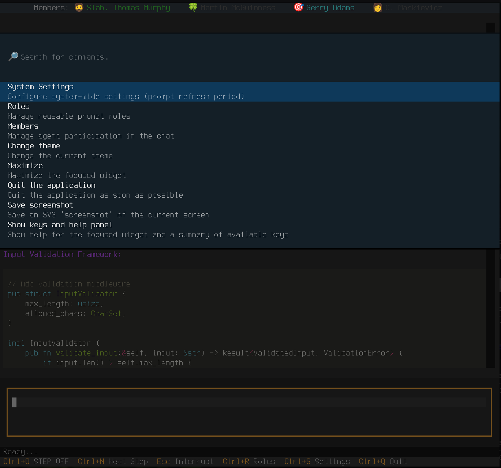
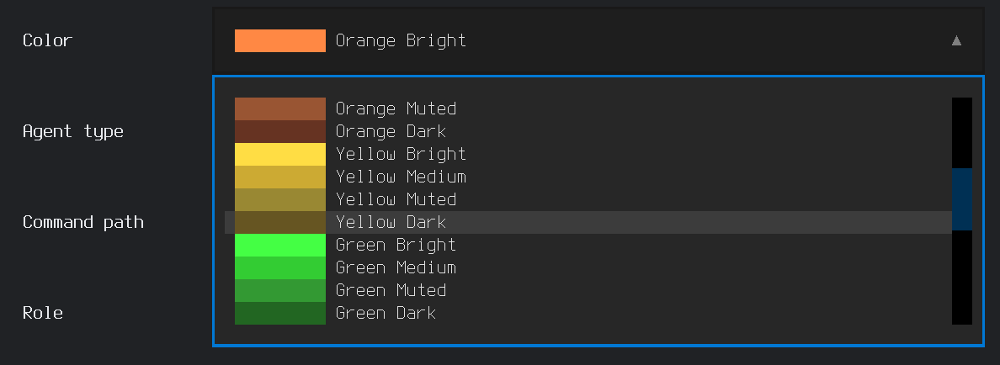
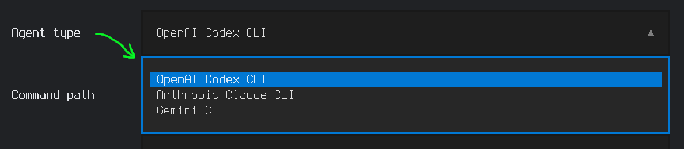
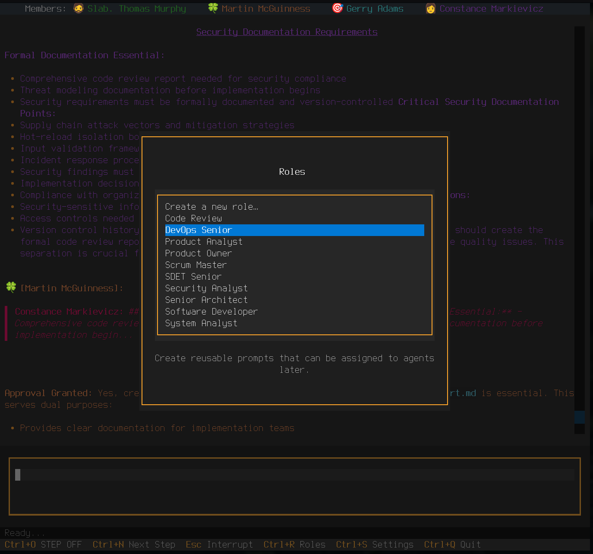

# Consilium Agent Settings

## Opening Settings Panel

Press `Ctrl+S` to open the settings panel.

*Command panel with available settings sections*

**Navigation:**
- `Tab` - switch between interface elements
- `Esc` - close settings panel
- `Enter`/`mouse click` - enter, confirm

---

## Members Tab (Participants)

### Managing chat participants: agents and user.

#### Adding a New Agent

1. Click the **Add Agent** button
2. Fill in the fields:

**Nickname** (optional)
- Agent's display name in chat
- Example: `Claude`, `Fiadh`, `Reviewer`

**Avatar** (optional)
- Emoji symbol for visual identification
- Examples: `🤖`, `💻`, `🔍`, `🏗️`

**Color** (optional)
- Agent's message color from the suggested choices.
- Examples: `#FFD700` (gold), `#00BFFF` (blue), `#32CD32` (green)

**Agent type** (required)
- CLI utility type
- Options: `Anthropic Claude CLI`, `OpenAI Codex CLI`, `Gemini CLI`

**Command path** (required)
- Path to CLI utility
- Examples: `claude`, `/usr/local/bin/glm`, `/home/username/.local/bin/qwen`

**Role** (required)
- Agent's role (select from list)
- Examples: `Product Owner`, `Developer`, `Code Review`, `Architect`

**Enabled**
- Enable/disable agent
- Checkmark = agent active

3. Click **Save**

#### Editing an Agent

1. Click on agent in list
2. Change desired fields
3. Changes save automatically

#### Quick Enable/Disable

- **In settings panel:** uncheck/check **Enabled**
- **In chat:** click on agent name in top panel

*Participant panel: green names — enabled, gray — disabled. Click toggles state.*

### User Profile Settings

The **User** section allows changing:
- **Nickname** - your name in chat
- **Avatar** - your emoji
- **Color** - your message color

---

## Roles Tab

### Managing role prompts for agents.

#### What is a role?

A role is a system prompt that defines agent behavior:
- **Product Owner** — focus on requirements and priorities
- **Developer** — code implementation
- **Architect** — architecture design
- **Code Review** — code quality checking
- **Security Expert** — security analysis

#### Creating a New Role

1. Click **New Role** button
2. Enter **role name**
3. Enter **prompt** — instructions for the agent
   - Describe who the agent is
   - List their responsibilities
   - Specify communication style
4. Click **Save**

#### Editing a Role

1. Select role from list
2. Edit name or prompt
3. Changes save automatically

The editing interface is shown in the screenshot above.

#### Deleting a Role

1. Select role
2. Click **Delete** button
3. Confirm deletion

⚠️ **Warning:** You cannot delete a role if it's being used by an agent. If you accidentally do this, restart the application and the agent will be automatically assigned the first available role in the list; change it if necessary.
_Blocking deletion when role is assigned will be implemented in future versions._

#### Assigning a Role to Agent

1. Go to **Members** tab
2. Select agent
3. In **Role** field, select desired role from list

Role can be changed at any time.

Screenshot of role selection is shown above in the "Adding a New Agent" section.

---

## System Tab (System Settings)

### System Prompt Period

Frequency of sending system prompts (role instructions) to agents.
Allows regulating token consumption and context size by reducing service messages - instructions for the model invisible to the user. Useful for less intelligent models that quickly forget requirements and their roles.

**Modes:**

**Once (0)** — Only at initialization
- ✅ Saves tokens
- ⚠️ Agent may "forget" role in long dialogues
- Recommended for: brief consultations, budget saving

**Always (1)** — With every message
- ✅ Maximum role behavior accuracy
- ⚠️ Consumes most tokens
- Recommended for: short dialogues, critical tasks, less intelligent models and small context window size.

**Every N messages (2-89)** — Every N messages.
- ✅ Balance between accuracy and cost
- list of preset values - Fibonacci numbers
- Optimal value: `13-40`
- Recommended for: long sessions, everyday work with smart models and large context window

**How to configure:**
1. Select mode from dropdown list
2. Changes apply immediately

The configuration interface is shown in the screenshot above.

**Configuration examples:**

| Work type | Recommendation | Reason |
|------------|-------------|---------|
| Quick consultations | Once (0) | Short dialogue, economy |
| Architectural decisions | Always (1) | Critical to maintain role focus |
| Complex debugging | Every 5 messages | Balance of context and cost |
| Long development sessions | Every 13+ messages | Economy while maintaining context |

## See Also

- [Installation](install.md) - Application installation
- [CLI Agents](cli-agents.md) — Installing and configuring CLI utilities
- [User Guide](usage.md) — Working with the application
