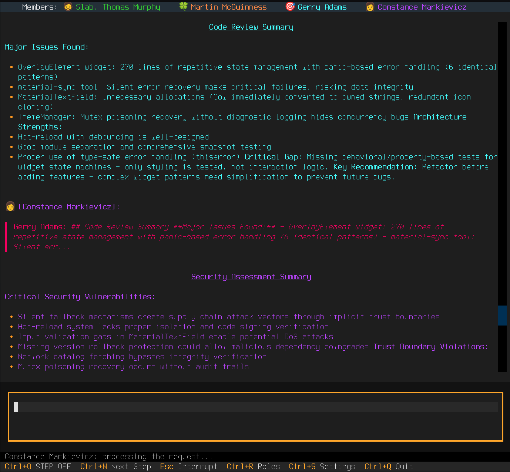

# Consilium Agent User Guide

## First Application Launch

```bash
cd /path/to/your/project
consilium
```

On first launch in a project folder:
- you'll see an empty chat screen and a flashing message at the bottom of the window in the status bar "`Press Ctrl+G to begin...`"


- If work has already been done in this folder previously, then the agents are ready to immediately read your message and start working.

**Before starting work with agents:**

1. **Add participants (agents)**
   - Press `Ctrl+S` → **Members** tab
   - Add agents through **Add Agent** button
   - For more details see [Settings - Members](settings.md#members-tab-participants)

2. **Assign roles to agents**
   - Select a role for each agent
   - For more details see [Settings - Roles](settings.md#roles-tab)

3. **Launch agents**
   - Press `Ctrl+G` (Go!) to start working
   - Agents will initialize, introduce themselves to you and each other, and start dialogue

⚠️ **Important:** Without added and configured participants and roles, agents won't be able to work or won't do it correctly!

### First Dialogue

*Example of first dialogue after launching agents. Participants introduce themselves and are ready to work.*
<a href="../../img/intro.png" target="_blank"></a>


> 💡 Depending on the texts of each `Role`, agents can be quite chatty right after first introduction to each other :). At any moment you can interrupt them by pressing Esc - you'll see a service message in chat `Interrupted by user`. Now you can enter a message, and they'll receive it immediately, stopping communication among themselves.


### Logging Levels

If there are any problems with agent operation, you can run the application with different logging levels and study the logs or send them as an `issue` to the project repository.

```bash
consilium           # INFO (default)
consilium DEBUG     # Debug information
consilium TRACE     # Full interaction protocol
consilium WARN      # Warnings only
consilium ERROR     # Errors only
```

---

## Interface

### Main Elements

The Consilium Agent interface consists of three main elements:
- **Participant panel** — at the top, shows all agents and their status
- **Chat area** — in the center, displays messages with markdown
- **Input field** — at the bottom, for entering your messages

### Participant Panel

The top panel shows all chat participants. Here you can temporarily disable and re-enable any agent with a mouse click. The agent's name will become dark - a sign of its disconnection.

**Status indicators:**
- **🔊** — Agent enabled and active
- **🔇** — Agent disabled

**Quick enable/disable:**
- Click on agent name to toggle

### Chat Area

- **Colored messages** — each participant has their own color
- **Markdown rendering** — supports code, tables, lists, links
- **Thinking indicators** — status bar at the bottom of the application - shows when agent is "thinking", i.e. the next cycle of message exchange from chat with CLI agent is happening.

---

## Chat Commands

### Text Commands

| Command | Description |
|---------|----------|
| `/exit` | Exit application |
| `/quit` | Exit application |

### TODO
- in the next release, finalize targeted delivery of service commands to each agent by sending a "secret" message to chat `@@Agent name /<command>`. "Secrecy" will allow delivering a service command for a specific agent, for example `/compact` for forced context compaction or for executing other **agent-specific** commands.

---

## Control Keys

### Basic Keys

| Key | Action |
|---------|----------|
| `Ctrl+G` | Launch agents (Go!) — on first launch |
| `Ctrl+C` | Quickly clear the input line of your message (composer) from typed text |
| `Ctrl+Q` | Exit application (Quit) |
| `Esc` | Stop all agents / Immediately interrupt dialogue in chat|

### Settings and Roles

| Key | Action |
|---------|----------|
| `Ctrl+S` | Open settings panel |
| `Ctrl+R` | Open roles panel (quick access) |

### Step-by-Step Mode

| Key | Action |
|---------|----------|
| `Ctrl+O` | Enable/disable step-by-step mode |
| `Ctrl+N` | Show next agent response |

**How it works:**
1. Press `Ctrl+O` to activate mode
2. Send message
3. Agents will start "thinking", but responses will be hidden
4. Press `Ctrl+N` to show responses one by one, "step by step"
5. Press `Ctrl+O` again to return to normal chat mode

**Application:**
- Architectural decisions with multiple opinions
- Thinking through each option separately
- Controlled information reception
- in future release - targeted delivery of agent-specific commands

### Navigation

| Key | Action |
|---------|----------|
| `Alt`+`↑` / `↓` | Command history in input field |

---

## @Mentions — Agent Mentions

Address a specific agent or group of agents, then your message will be delivered to them immediately and they'll be able to answer you earlier than others or you'll prompt them to **prioritize** attention to your message.

### Syntax

```
@AgentName your message
@Agent1 @Agent2 message for multiple agents
```

### Examples

**One agent:**
```
> @Claude what do you think about this code?
```

**Multiple agents:**
```
> @Gemini @Codex evaluate this service architecture
```

### Behavior

- Mentioned agents **must** respond
- Other agents **see** the message, but may not respond at their discretion
- Used for directed questions and requirements

### Use cases

- Request expertise from specific agent
- Get opinions of several specific specialists
- Divide responsibilities (architect + developer)

---

## @@Secret — Private Messages

Secret consultation with one agent.

### Syntax

```
@@AgentName private message
```

### Examples

```
> @@Claude this is confidential: how to fix a bug in module X?
```

### Behavior

- 🔒 Only specified agent **sees** the message
- 🔒 Agent's response is also **private**
- 👁️ Other participants see: `🔒 Secret message`
- 👁️ Only you and the addressee can read

### Use cases

- Private consultations
- Code review without publicity
- Testing ideas before public discussion
- Request second opinion without "disturbing the minds" of other agents.
- Targeted delivery of special commands (in the future)

**Session example:**
```
> @@Claude I think Gemini's architecture is not optimal. What do you say?

[Claude]: 🔒 I agree, there are scalability problems...

> @Gemini let's try a different approach
```

---

## Markdown in Messages

Consilium Agent supports full Markdown rendering in console execution with certain limitations - there's no way to view `mermaid` diagrams in graphical form - only text. Headers may look unusual as bold underlined text, etc. - limitation of console mode.


---

## Workflow: Scrum Development Team

> **Team:** Product Owner, Scrum Master, Architect, Developer, QA Engineer, DevOps

### 1. Sprint Planning

```
> Starting sprint. Feature: notification system. Estimate complexity.

[PO]: User story: user receives email on new comment...
[Architect]: Need: Queue (Redis), Worker, SMTP, Database schema...
[Developer]: Estimate 8 story points. Split into 3 tasks.
[Scrum Master]: Agreed. Into sprint.
```

### 2. Architecture Meeting

```
> @Architect design notification system

[Architect]: Proposing event-driven architecture:
- Event Bus (Redis Streams)
- Notification Service (async workers)
- Template Engine
- Retry mechanism
Creating ADR document...

> @@DevOps is infrastructure ready for Redis?
[DevOps]: 🔒 Redis Cluster already deployed in staging. Will configure endpoints.
```

### 3. Decomposition and Tasks

```
> @PO @all decompose design-doc into stories and tasks

[PO]: Story "Email notifications" →
  TASK-101: SMTP service integration
  TASK-102: Email notification templates
  TASK-103: Event triggers
  TASK-104: Notification management UI

[Architect]: TASK-105: Config for retry policy
[QA]: TASK-106: E2E tests for notification flow
```

### 4. Development

```
[ScrumMaster]: @Developer start TASK-101

[Developer]: Implemented:
- Migration for emails table
- Model with indexes
- EventPublisher for UserCommented event
Ready for review.

> @Architect @QA code review
[Architect]: ✅ Architecture matches ADR
[Reviewer]: ⚠️ Unit tests missing for EventPublisher
```

<a href="../../img/review.png" target="_blank"></a>

### 5. Fixes and CI/CD

```
> @Developer fix QA comments

[Developer]: Added tests. Coverage 94%. Push to feature/notifications.

> @DevOps deploy to staging
[DevOps]:
- CI passed ✅
- Deploying to staging...
- Migration applied
- Service restarted
- Health check OK ✅

> @QA run e2e tests
[QA]: Ran smoke tests... All passed. Regression suite launched.
```

<a href="../../img/fix.png" target="_blank"></a>

### 6. Monitoring and Hotfix

```
> @DevOps what's in staging logs?

[DevOps]: ERROR: SMTP timeout after 30s. Rate limit from provider.

> @QA create bug report
[QA]: Created HOTFIX-001: SMTP timeout on staging. Priority: Critical.

> @Developer fix HOTFIX-001
[Developer]: Analyzing... Need retry with exponential backoff.
[Developer]: Implemented RetryPolicy(max=3, delay=2^n). Commit to hotfix/smtp-retry.

> @Architect review hotfix
[Architect]: ✅ Solution correct. Approve.

> @DevOps deploy hotfix
[DevOps]: Deployed to production. Monitoring: error rate dropped to 0%.
```

### 7. Sprint Review

```
[Scrum Master]: Summarizing sprint. Completed 6/6 tasks. Velocity: 8 SP. Burndown: normal.
[PO]: Stakeholder demo passed successfully. Feedback: add Slack notifications.
[Developer]: Technical debt: need Template Engine refactoring.
[QA]: 2 bugs in production (minor). Created TASK-107, TASK-108.

> Planning next sprint: Slack integration + tech debt
```

---

## Operating Modes

### Semi-asynchronous Mode (default)

User asks question to everyone, but enabled agents always respond sequentially, in turn.

```
> Question for everyone

Claude thinking...
Gemini thinking...
Codex thinking...

[Claude]: My answer...
[Gemini]: My opinion...
[Codex]: My solution...
```

### Step-by-Step Mode

Responses appear one by one when pressing `Ctrl+N`.

```
> Question [Ctrl+O enabled]

Claude thinking...
Gemini thinking...
Codex thinking...

[Press Ctrl+N] → [Claude]: ...
[Press Ctrl+N] → [Gemini]: ...
[Press Ctrl+N] → [Codex]: ...
```

### Selective Mode

Temporarily disable unnecessary agents.

**Method 1:** Click on agent name in top panel
**Method 2:** Use @mentions for specific agents

---

## Persistence and Sessions

### Automatic Saving

Consilium automatically saves:
- History of all messages
- Session ID of each agent
- Message counters
- Workspace settings

### Resuming Work

After restart in the same directory:
```bash
cd /same/project
consilium
```

You get:
- Chat history for last 2000 messages
- Agents with saved context
- All settings

### Working with Different Projects

```bash
cd /project-A
consilium  # Workspace A

cd /project-B
consilium  # Workspace B (independent)
```

Each project has:
- Its own history
- Its own settings
- Its own agent sessions

---

## Tips and Tricks

### Effective Work

1. **Use @mentions** for directed questions
2. **Step-by-Step** for complex decisions requiring deliberation
3. **@@Secret** for private consultations or sending service commands to individual agents(todo)
4. **Disable inactive agents** for speedup (click in panel) or avoiding unnecessary discussions.
5. **Assign correct roles** for relevant answers and quality task execution.

### Token Economy

1. Disable unnecessary agents
2. Use @mentions instead of broadcast messages
3. Configure System Prompt Period (see [Settings](settings.md))

### Answer Quality

1. **Clear questions** = clear answers
2. **Specialized roles** for agents
3. **Cross-validation** through multiple agents
4. **Iterative clarification** in dialogue

---

## Troubleshooting

### Agent Not Responding

1. Check that agent is enabled (🔊 in panel)
2. Check logs: `consilium DEBUG` or `consilium TRACE`
3. See [CLI Agents](cli-agents.md) for installation verification

### Session Not Restoring

1. Ensure you're launching from the same directory
2. Check logs: `consilium DEBUG | grep Session` or `consilium TRACE | grep Session`

### Formatting Errors

If Markdown isn't rendering:
- Ensure correct syntax
- Use triple backticks for code blocks or service words that may be escaped by md-filter. For example, if you want to send to chat the message "Look, ", you need to write in composer like this: "Look, \`\`", wrapping service words in backticks \`...\`

---

## See Also

- [Installation](install.md) - Application installation
- [CLI Agents](cli-agents.md) — Installing and configuring CLI utilities
- [Settings](settings.md) — Configuring agents and roles
