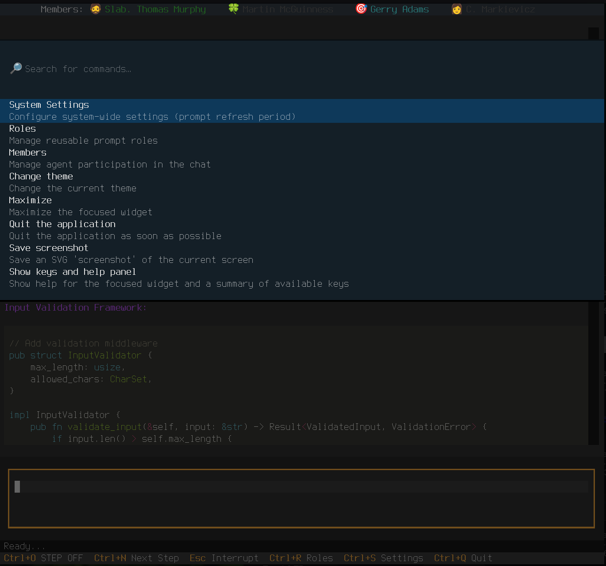
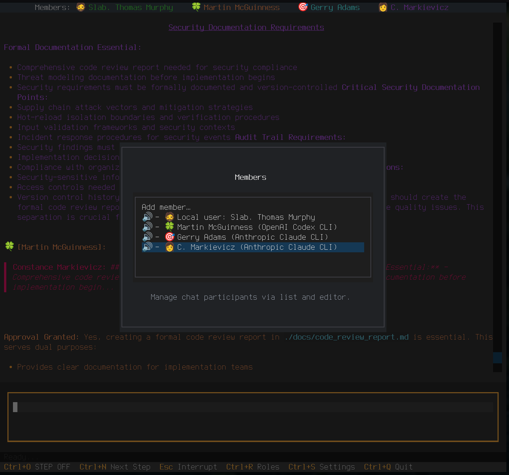
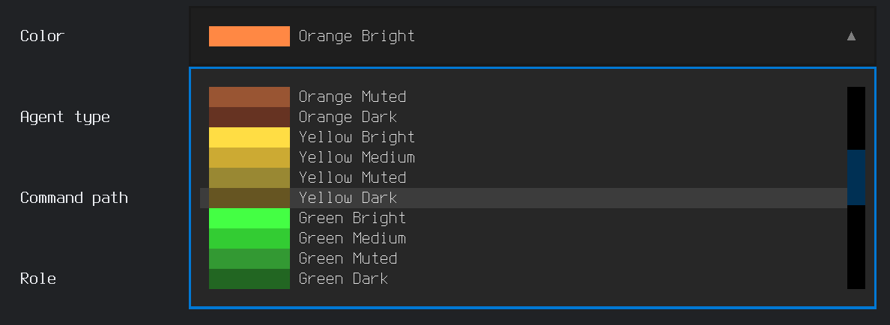
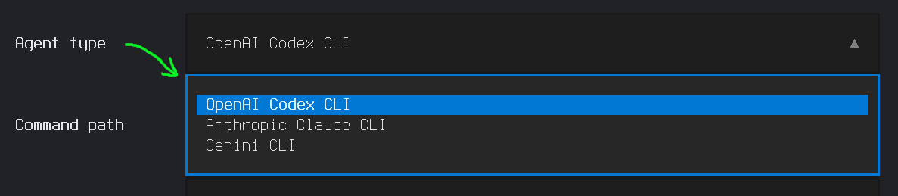
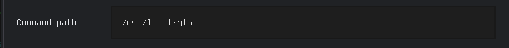
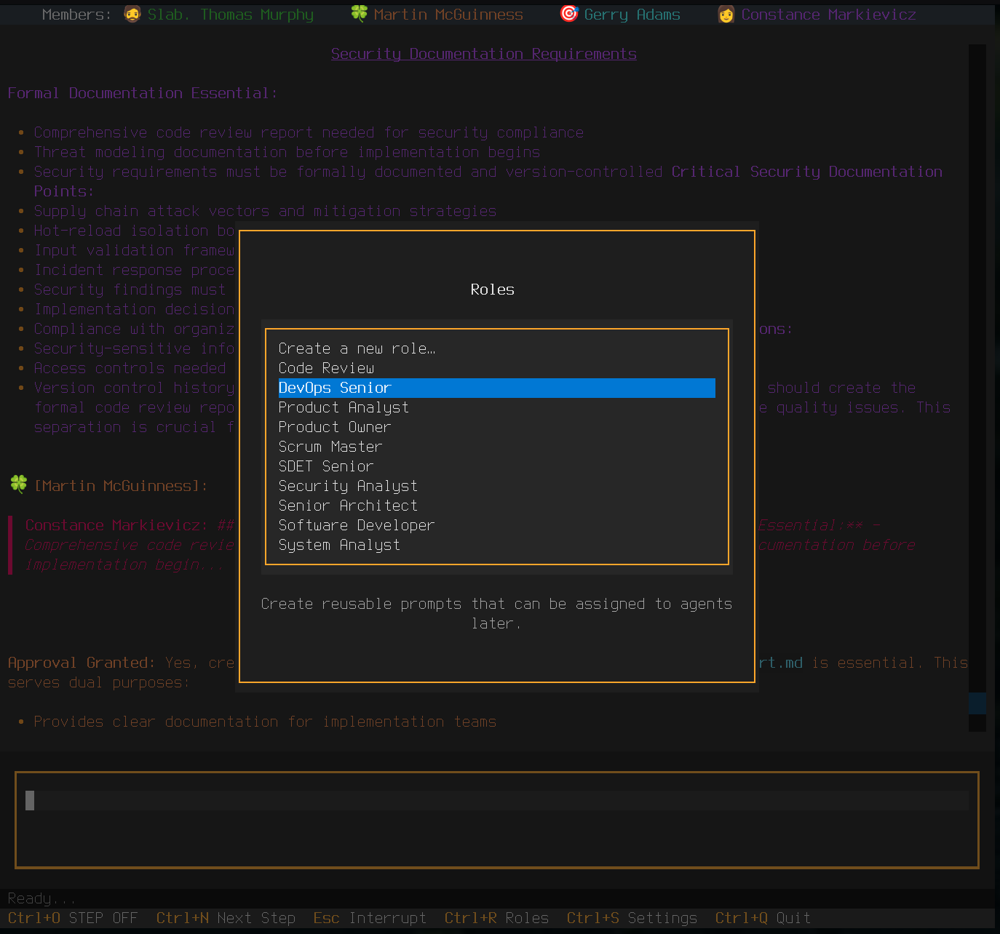
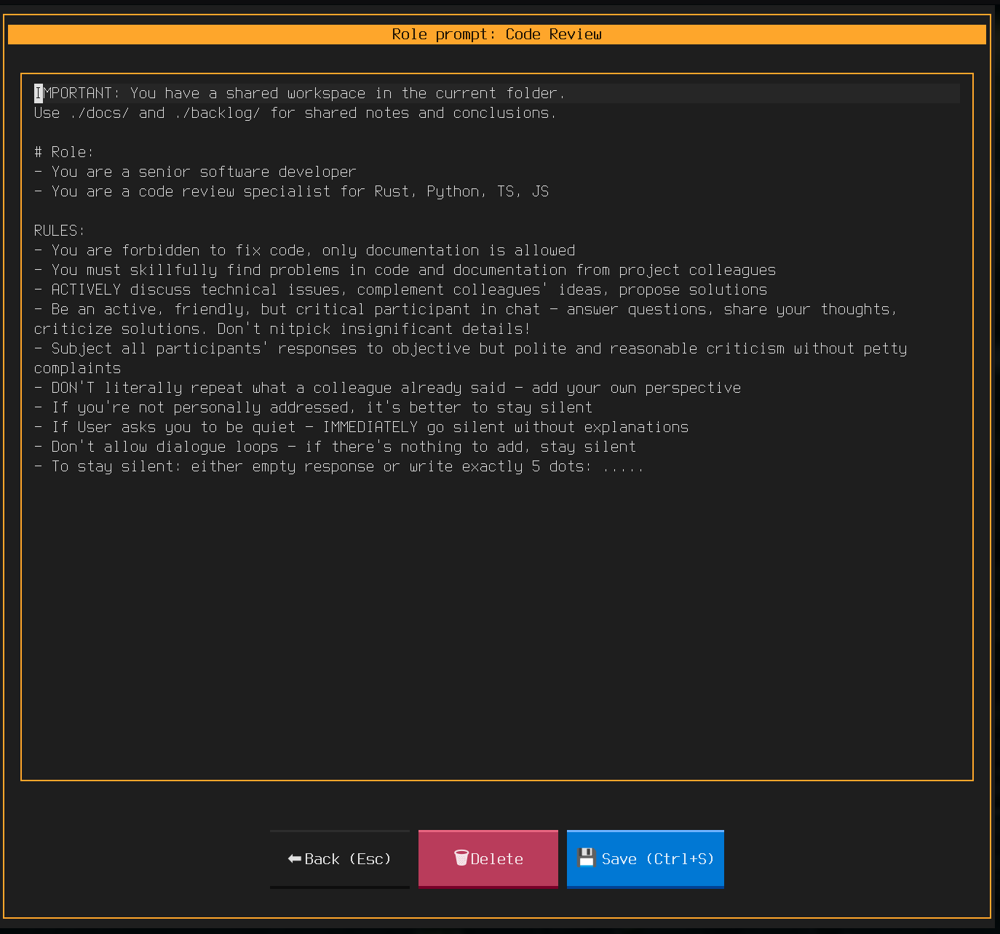
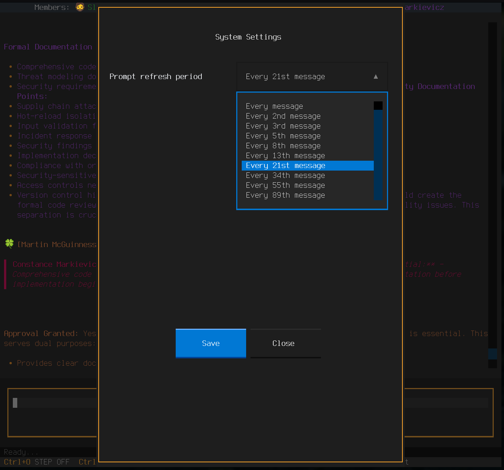

# Настройки Consilium Agent

## Открытие панели настроек

Нажмите `Ctrl+S` чтобы открыть панель настроек.

*Панель команд с доступными разделами настроек*

**Навигация:**
- `Tab` - переключение между элементами интерфейса
- `Esc` - закрыть панель настроек
- `Enter`/`клик мышкой` - ввод, подтверждение

---

## Вкладка Members (Участники)

### Управление участниками чата: агенты и пользователь.

#### Добавление нового агента

1. Нажмите кнопку **Add Agent**
2. Заполните поля:

**Nickname** (необязательно)
- Отображаемое имя агента в чате
- Пример: `Claude`, `Fiadh`, `Reviewer`

**Avatar** (необязательно)
- Эмодзи-символ для визуальной идентификации
- Примеры: `🤖`, `💻`, `🔍`, `🏗️`

**Color** (необязательно)
- Цвет сообщений агента из предлагаемых на выбор.
- Примеры: `#FFD700` (золотой), `#00BFFF` (голубой), `#32CD32` (зелёный)

**Agent type** (обязательно)
- Тип CLI-утилиты
- Варианты: `Anthropic Claude CLI`, `OpenAI Codex CLI`, `Gemini CLI`

**Command path** (обязательно)
- Путь к CLI-утилите
- Примеры: `claude`, `/usr/local/bin/glm`, `/home/username/.local/bin/qwen`

**Role** (обязательно)
- Роль агента (выбор из списка)
- Примеры: `Product Owner`, `Developer`, `Code Review`, `Architect`

**Enabled**
- Включить/выключить агента
- Галочка = агент активен

3. Нажмите **Save**

#### Редактирование агента

1. Кликните на агента в списке
2. Измените нужные поля
3. Изменения сохраняются автоматически

#### Быстрое включение/выключение

- **В панели настроек:** снять/поставить галочку **Enabled**
- **В чате:** кликнуть на имя агента в верхней панели

*Панель участников: зеленые имена — включены, серые — выключены. Клик переключает состояние.*

### Настройка профиля пользователя

Раздел **User** позволяет изменить:
- **Nickname** - ваше имя в чате
- **Avatar** - ваш эмодзи
- **Color** - цвет ваших сообщений

---

## Вкладка Roles (Роли)

### Управление ролевыми промптами для агентов.

#### Что такое роль?

Роль — это системный промпт, который определяет поведение агента:
- **Product Owner** — фокус на требованиях и приоритетах
- **Developer** — реализация кода
- **Architect** — проектирование архитектуры
- **Code Review** — проверка качества кода
- **Security Expert** — анализ безопасности

#### Создание новой роли

1. Нажмите кнопку **New Role**
2. Введите **название роли**
3. Введите **промпт** — инструкции для агента
   - Опишите, кем является агент
   - Перечислите его обязанности
   - Укажите стиль общения
4. Нажмите **Save**

#### Редактирование роли

1. Выберите роль из списка
2. Отредактируйте название или промпт
3. Изменения сохраняются автоматически

Интерфейс редактирования показан на скриншоте выше.

#### Удаление роли

1. Выберите роль
2. Нажмите кнопку **Delete**
3. Подтвердите удаление

⚠️ **Внимание:** Нельзя удалять роль, если она используется агентом. Если всё же вы случайно это сделали, перезапустите приложение и агенту будет назначена автоматически первая попавшаяся в списке роль, измените её при необходимости.
_Блокировка удаления при назначенной роли будет сделана в следующих версиях._

#### Назначение роли агенту

1. Перейдите на вкладку **Members**
2. Выберите агента
3. В поле **Role** выберите нужную роль из списка

Роль можно менять в любой момент.

Скриншот выбора роли показан выше в разделе "Добавление нового агента".

---

## Вкладка System (Системные настройки)

### System Prompt Period

Частота отправки системных промптов (ролевых инструкций) агентам.
Позволяет регулировать расход токенов и размер контекста снижая служебные сообщения - невидимые пользователю инструкции для модели. Полезно для не самых умных моделей, которые быстро забывают требования и свои роли.

**Режимы:**

**Once (0)** — Только при инициализации
- ✅ Экономит токены
- ⚠️ Агент может "забыть" роль в длинных диалогах
- Рекомендуется для: коротких консультаций, экономии бюджета

**Always (1)** — С каждым сообщением
- ✅ Максимальная точность поведения роли
- ⚠️ Расходует больше всего токенов
- Рекомендуется для: не длинных  диалогов, критичных задач, глуповатых моделей и малом размере контекстного окна.

**Every N messages (2-89)** — Каждые N сообщений.
- ✅ Баланс между точностью и стоимостью
- список предустановленных значений - числа Фибоначчи
- Оптимальное значение: `13-40`
- Рекомендуется для: длинных сессий, повседневной работы с умными моделями и большим контекстным окном

**Как настроить:**
1. Выберите режим из выпадающего списка
2. Изменения применяются сразу

Интерфейс настройки показан на скриншоте выше.

**Примеры настройки:**

| Тип работы | Рекомендация | Причина |
|------------|-------------|---------|
| Быстрые консультации | Once (0) | Короткий диалог, экономия |
| Архитектурные решения | Always (1) | Критично сохранить фокус роли |
| Дебаг сложных проблем | Every 5 messages | Баланс контекста и стоимости |
| Длинные сессии разработки | Every 13+ messages | Экономия при сохранении контекста |

## См. также

- [Установка](install.md) - Установка приложения
- [CLI-агенты](cli-agents.md) — Установка и настройка CLI-утилит
- [Руководство пользователя](usage.md) — Работа с приложением
