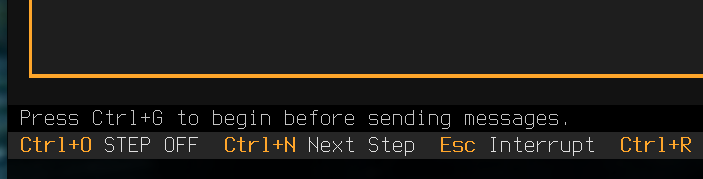
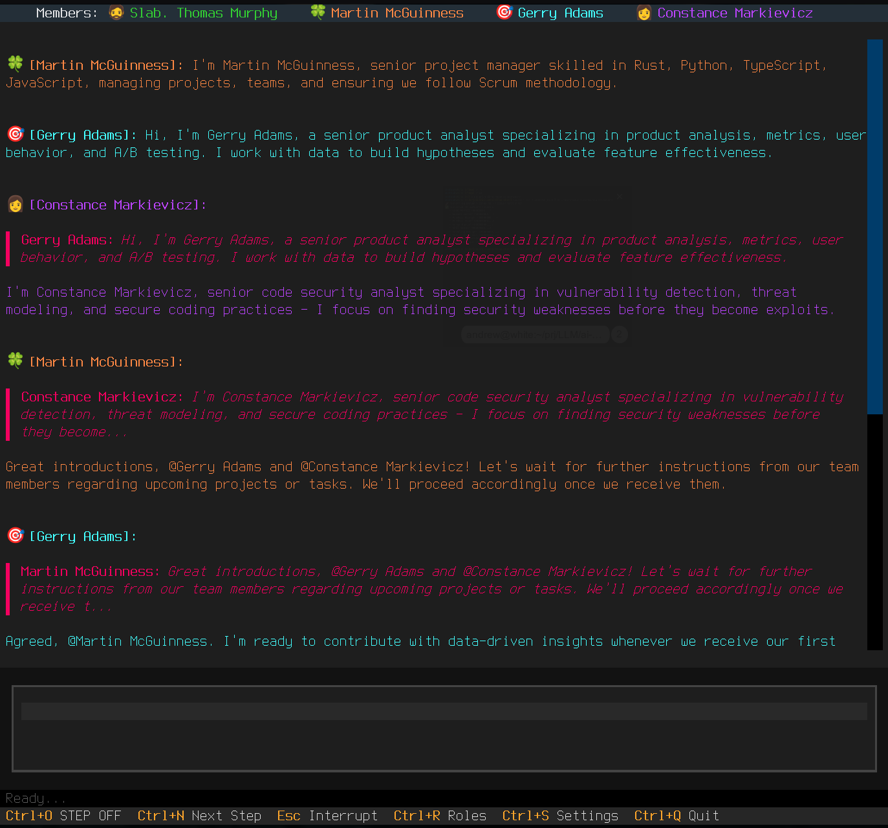
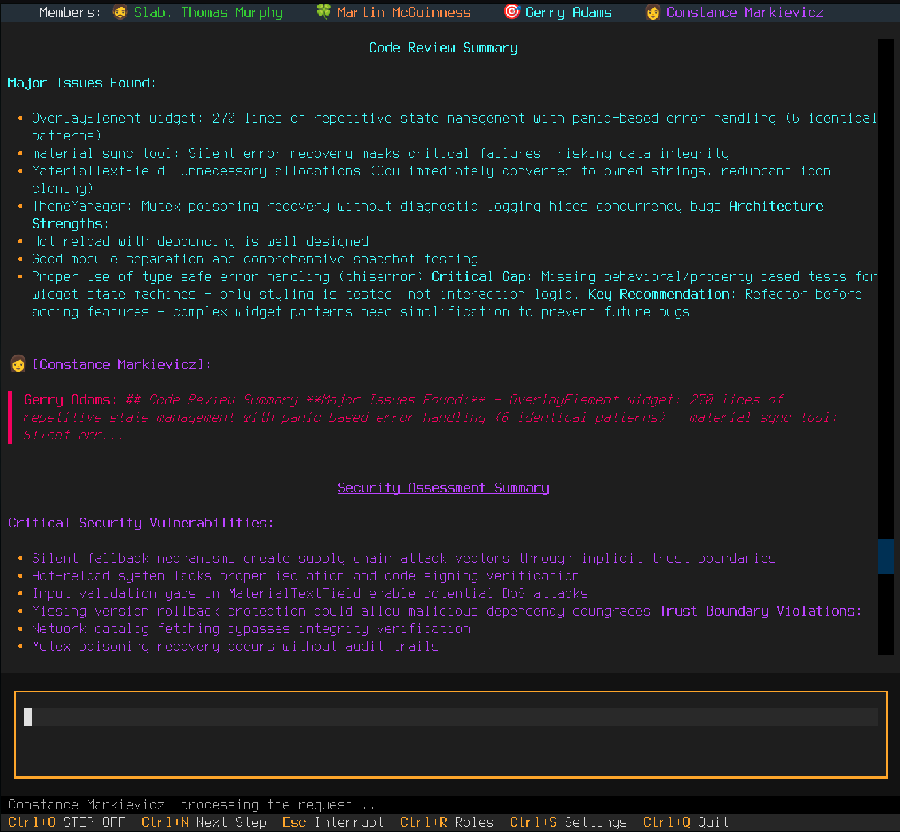
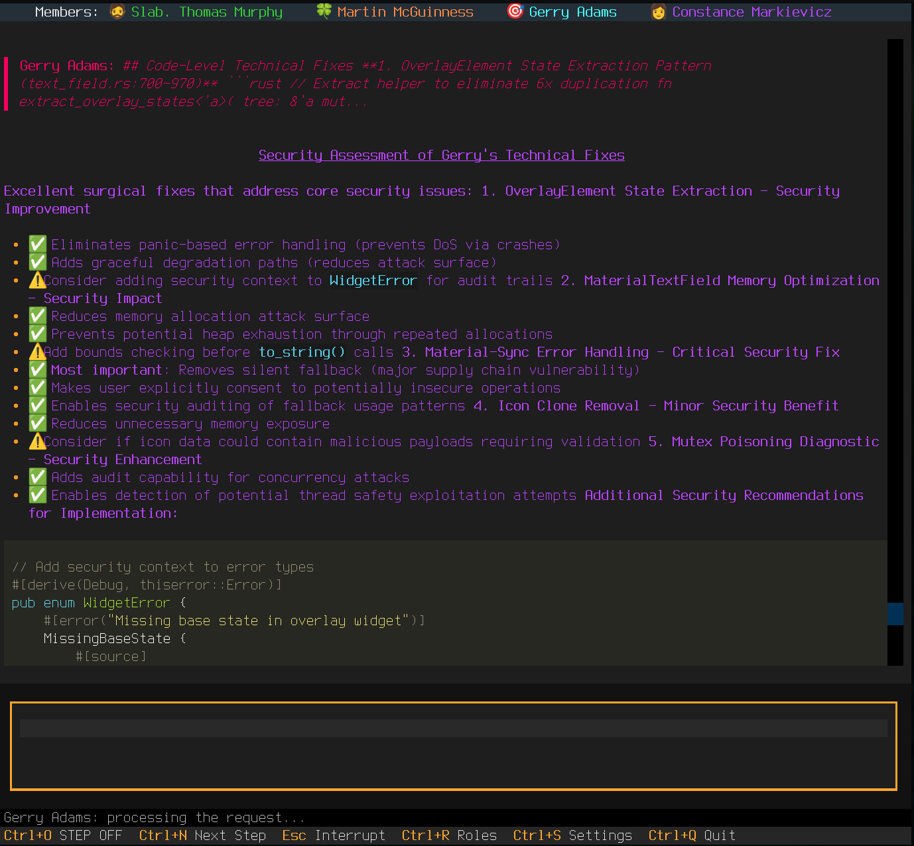

# Руководство пользователя Consilium Agent

## Первый запуск приложения

```bash
cd /path/to/your/project
consilium
```

При первом запуске в папке проекта:
- вы увидите пустой экран чата и мигающее сообщение внизу окна в статус-баре "`Press Ctrl+G to begin...`"



- Если работа уже велась в этой папке ранее, то агенты готовы сразу прочитать ваше сообщение и начать работу.

**Перед началом работы с агентами:**

1. **Добавьте участников (агентов)**
   - Нажмите `Ctrl+S` → вкладка **Members**
   - Добавьте агентов через кнопку **Add Agent**
   - Подробнее см. [Настройки - Members](settings.md#вкладка-members-участники)

2. **Назначьте роли агентам**
   - Выберите роль для каждого агента
   - Подробнее см. [Настройки - Roles](settings.md#вкладка-roles-роли)

3. **Запустите агентов**
   - Нажмите `Ctrl+G` (Go!) для начала работы
   - Агенты инициализируются, представятся вам, друг другу и начнут диалог

⚠️ **Важно:** Без добавленных и настроенных участников и ролей агенты не смогут работать или не будут это делать корректно!

### Первый диалог

*Пример первого диалога после запуска агентов. Участники представляются и готовы к работе.*
<a href="../../img/intro.png" target="_blank"></a>


> 💡 В зависимости от текстов каждой `Роли` агенты могут быть довольно болтливыми сразу после первого представления друг другу :). В любой момент вы можете прервать их, нажав клавишу Esc - увидите в чате служебное сообщение `Interrupted by user`. Теперь можете вводить сообщение, и они сразу его получат, прекратив общение между собой.


### Уровни логирования

При возникновении каких-либо проблем работы агентов, вы можете запускать приложение с разным уровнем логирования и изучить логи или отправить их в виде `issue` в репозиторий проекта.

```bash
consilium           # INFO (по умолчанию)
consilium DEBUG     # Отладочная информация
consilium TRACE     # Полный протокол взаимодействия
consilium WARN      # Только предупреждения
consilium ERROR     # Только ошибки
```

---

## Интерфейс

### Основные элементы

Интерфейс Consilium Agent состоит из трёх основных элементов:
- **Панель участников** — вверху, показывает всех агентов и их статус
- **Область чата** — в центре, отображение сообщений с markdown
- **Поле ввода** — внизу, для ввода ваших сообщений

### Панель участников

Верхняя панель показывает всех участников чата. Здесь вы можете временно отключить и включить обратно любого агента кликом мышки. Имя агента станет тёмным - признак его выключения.

**Индикаторы состояния:**
- **🔊** — Агент включён и активен
- **🔇** — Агент отключён

**Быстрое включение/выключение:**
- Кликните на имя агента для переключения

### Область чата

- **Цветные сообщения** — каждый участник имеет свой цвет
- **Markdown рендеринг** — поддержка кода, таблиц, списков, ссылок
- **Thinking indicators** — статус-бар внизу приложения - показывает, когда агент "думает", то есть происходит очередной цикл обмена сообщениями из чата с cli-агентом.

---

## Команды чата

### Текстовые команды

| Команда | Описание |
|---------|----------|
| `/exit` | Выход из приложения |
| `/quit` | Выход из приложения |

### TODO
- в следующем релизе доработать адресную доставку служебных команд каждому агенту через отправку "секретного" сообщения в чат `@@Agent name /<command>`. "Секретность" позволит доставить служебную команду для конкретного агента, например `/compact` для принудительной компактификации контекста или для выполнения иных **специфических для данного агента** команд.

---

## Управляющие клавиши

### Основные клавиши

| Клавиша | Действие |
|---------|----------|
| `Ctrl+G` | Запустить агентов (Go!) — при первом запуске |
| `Ctrl+C` | Быстро очистить от набираемого текста строку ввода вашего сообщения (композер) |
| `Ctrl+Q` | Выход из приложения (Quit) |
| `Esc` | Остановить всех агентов / Немедленно прервать диалог в чате|

### Настройки и роли

| Клавиша | Действие |
|---------|----------|
| `Ctrl+S` | Открыть панель настроек |
| `Ctrl+R` | Открыть панель ролей (быстрый доступ) |

### Пошаговый режим (Step-by-Step)

| Клавиша | Действие |
|---------|----------|
| `Ctrl+O` | Включить/выключить пошаговый режим |
| `Ctrl+N` | Показать следующий ответ агента |

**Как работает:**
1. Нажмите `Ctrl+O` для активации режима
2. Отправьте сообщение
3. Агенты начнут "думать", но ответы будут скрыты
4. Нажимайте `Ctrl+N` чтобы показывать ответы по одному, "пошагово"
5. Нажмите `Ctrl+O` снова для возврата к обычному режиму чата

**Применение:**
- Архитектурные решения с несколькими мнениями
- Обдумывание каждого варианта отдельно
- Контролируемое получение информации
- в будущем релизе - адресная доставка специфичных для каждого агента команд

### Навигация

| Клавиша | Действие |
|---------|----------|
| `Alt`+`↑` / `↓` | История команд в поле ввода |

---

## @Mentions — Упоминания агентов

Обратитесь к конкретному агенту или группе агентов, тогда ваше сообщение будет доставлено им немедленно и они смогут ответить вам раньше других или вы побудите их **приоритетно** обратить внимание на ваше сообщение.

### Синтаксис

```
@AgentName ваше сообщение
@Agent1 @Agent2 сообщение для нескольких агентов
```

### Примеры

**Один агент:**
```
> @Claude что думаешь об этом коде?
```

**Несколько агентов:**
```
> @Gemini @Codex оцените архитектуру этого сервиса
```

### Поведение

- Упомянутые агенты **обязаны** ответить
- Остальные агенты **видят** сообщение, но могут не отвечать по их желанию
- Используется для направленных вопросов и требований

### Use cases

- Запросить экспертизу конкретного агента
- Получить мнения отдельных нескольких специалистов
- Разделить обязанности (архитектор + разработчик)

---

## @@Secret — Приватные сообщения

Секретная консультация с одним агентом.

### Синтаксис

```
@@AgentName приватное сообщение
```

### Примеры

```
> @@Claude это конфиденциально: как исправить баг в модуле X?
```

### Поведение

- 🔒 Только указанный агент **видит** сообщение
- 🔒 Ответ агента тоже **приватный**
- 👁️ Другие участники видят: `🔒 Secret message`
- 👁️ Читать могут только вы и адресат

### Use cases

- Частные консультации
- Проверка кода без огласки
- Тестирование идей перед публичным обсуждением
- Запрос второго мнения без "беспокойства ума" других агентов.
- Адресная доставка спец-команд (в будущем)

**Пример сессии:**
```
> @@Claude я думаю, что архитектура от Gemini не оптимальна. Что скажешь?

[Claude]: 🔒 Согласен, есть проблемы с масштабируемостью...

> @Gemini давай попробуем другой подход
```

---

## Markdown в сообщениях

Consilium Agent поддерживает полный Markdown рендеринг в консольном исполнении с определёнными ограничениями - нет возможности посмотреть диаграммы `mermaid` в графическом виде - только текст. Заголовки могут выглядеть необычно как жирный подчёркнутый текст и т.д. - ограничение консольного режима.


---

## Workflow: Scrum-команда разработки

> **Команда:** Product Owner, Scrum Master, Architect, Developer, QA Engineer, DevOps

### 1. Sprint Planning

```
> Начинаем спринт. Фича: система уведомлений. Оцените сложность.

[PO]: User story: пользователь получает email при новом комментарии...
[Architect]: Нужны: Queue (Redis), Worker, SMTP, Database schema...
[Developer]: Оцениваю в 8 story points. Разбить на 3 задачи.
[Scrum Master]: Согласовано. В спринт.
```

### 2. Архитектурный митинг

```
> @Architect спроектируй систему уведомлений

[Architect]: Предлагаю event-driven архитектуру:
- Event Bus (Redis Streams)
- Notification Service (async workers)
- Template Engine
- Retry mechanism
Создаю ADR документ...

> @@DevOps готова ли инфраструктура для Redis?
[DevOps]: 🔒 Redis Cluster уже развернут в staging. Настрою endpoints.
```

### 3. Декомпозиция и таски

```
> @PO @all декомпозируйте design-doc на истории и таски

[PO]: История "Email notifications" →
  TASK-101: Интеграция SMTP-сервиса
  TASK-102: Шаблоны email-уведомлений
  TASK-103: Триггеры для событий
  TASK-104: UI управления нотификациями

[Architect]: TASK-105: Конфиг для retry policy
[QA]: TASK-106: E2E тесты для notification flow
```

### 4. Разработка

```
[ScrumMaster]: @Developer начинай TASK-101

[Developer]: Реализовал:
- Migration для таблицы писем
- Model с индексами
- EventPublisher для UserCommented event
Готово к review.

> @Architect @QA code review
[Architect]: ✅ Архитектура соответствует ADR
[Reviewer]: ⚠️ Отсутствуют unit-тесты для EventPublisher
```

<a href="../../img/review.png" target="_blank"></a>

### 5. Исправления и CI/CD

```
> @Developer исправь замечания QA

[Developer]: Добавил тесты. Coverage 94%. Push в feature/notifications.

> @DevOps задеплой на staging
[DevOps]:
- CI passed ✅
- Deploying to staging...
- Migration applied
- Service restarted
- Health check OK ✅

> @QA прогони e2e тесты
[QA]: Запустил smoke tests... Все прошли. Regression suite запущен.
```

<a href="../../img/fix.png" target="_blank"></a>

### 6. Monitoring и Hotfix

```
> @DevOps что в логах на staging?

[DevOps]: ERROR: SMTP timeout после 30s. Rate limit от провайдера.

> @QA создай багрепорт
[QA]: Создал HOTFIX-001: SMTP timeout на staging. Priority: Critical.

> @Developer исправь HOTFIX-001
[Developer]: Анализирую... Нужен retry с exponential backoff.
[Developer]: Реализовал RetryPolicy(max=3, delay=2^n). Коммит в hotfix/smtp-retry.

> @Architect ревью hotfix
[Architect]: ✅ Решение корректное. Approve.

> @DevOps деплой hotfix
[DevOps]: Deployed to production. Monitoring: error rate снизился до 0%.
```

### 7. Sprint Review

```
[Scrum Master]:  Подводим итоги спринта. Завершено 6/6 тасок. Velocity: 8 SP. Burndown: в норме.
[PO]: Demo stakeholders прошло успешно. Feedback: добавить Slack уведомления.
[Developer]: Technical debt: нужен рефакторинг Template Engine.
[QA]: 2 бага в production (minor). Создал TASK-107, TASK-108.

> Планируем следующий спринт: Slack integration + tech debt
```

---

## Режимы работы

### Полу-асинхронный режим (по умолчанию)

Пользователь задаёт вопрос всем, но включённые агенты отвечают всегда последовательно, по очереди.

```
> Вопрос для всех

Claude thinking...
Gemini thinking...
Codex thinking...

[Claude]: Мой ответ...
[Gemini]: Моё мнение...
[Codex]: Моё решение...
```

### Step-by-Step режим

Ответы появляются по одному при нажатии `Ctrl+N`.

```
> Вопрос [Ctrl+O включён]

Claude thinking...
Gemini thinking...
Codex thinking...

[Нажать Ctrl+N] → [Claude]: ...
[Нажать Ctrl+N] → [Gemini]: ...
[Нажать Ctrl+N] → [Codex]: ...
```

### Селективный режим

Временно отключите ненужных агентов.

**Способ 1:** Клик на имя агента в верхней панели
**Способ 2:** Используйте @mentions для конкретных агентов

---

## Персистентность и сессии

### Автоматическое сохранение

Consilium автоматически сохраняет:
- Историю всех сообщений
- Session ID каждого агента
- Счётчики сообщений
- Настройки workspace

### Возобновление работы

После перезапуска в той же директории:
```bash
cd /same/project
consilium
```

Вы получите:
- Историю чата на последние 2000 сообщений
- Агентов с сохранённым контекстом
- Все настройки

### Работа с разными проектами

```bash
cd /project-A
consilium  # Workspace A

cd /project-B
consilium  # Workspace B (независимый)
```

Каждый проект имеет:
- Свою историю
- Свои настройки
- Свои сессии агентов

---

## Советы и трюки

### Эффективная работа

1. **Используйте @mentions** для направленных вопросов
2. **Step-by-Step** для сложных решений с обдумыванием
3. **@@Secret** для приватных консультаций или отправки служебных команд отдельным агентам(todo)
4. **Отключайте неактивных агентов** для ускорения (клик в панели) или избегания ненужных обсуждений.
5. **Назначайте правильные роли** для релевантных ответов и качества выполнения заданий.

### Экономия токенов

1. Отключите ненужных агентов
2. Используйте @mentions вместо широковещательных сообщений
3. Настройте System Prompt Period (см. [Настройки](settings.md))

### Качество ответов

1. **Чёткие вопросы** = чёткие ответы
2. **Специализированные роли** для агентов
3. **Cross-validation** через несколько агентов
4. **Итеративное уточнение** в диалоге

---

## Устранение проблем

### Агент не отвечает

1. Проверьте, что агент включён (🔊 в панели)
2. Проверьте логи: `consilium DEBUG` или `consilium TRACE`
3. См. [CLI-агенты](cli-agents.md) для проверки установки

### Сессия не восстанавливается

1. Убедитесь, что запускаете из той же директории
2. Проверьте логи: `consilium DEBUG | grep Session` или `consilium TRACE | grep Session`

### Ошибки форматирования

Если Markdown не рендерится:
- Убедитесь в правильности синтаксиса
- Используйте тройные обратные кавычки для кодовых блоков или служебных слов, которые могут экранироваться md-фильтром. Например, если хотите отправить в чат сообщение "Посмотрите, ", то надо написать в композере так: "Посмотрите, \`\`", взяв служебные слова в обратные кавычки \`...\`

---

## См. также

- [Установка](install.md) - Установка приложения
- [CLI-агенты](cli-agents.md) — Установка и настройка CLI-утилит
- [Настройки](settings.md) — Настройка агентов и ролей
